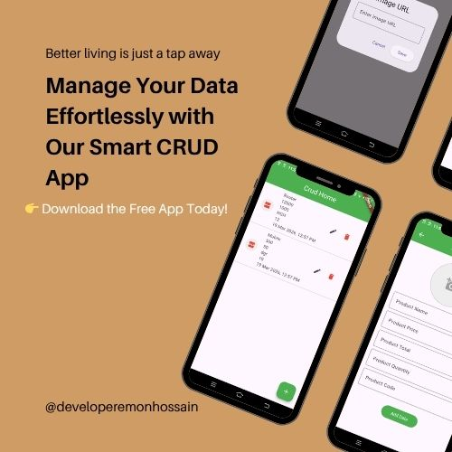

# 📱 Simple CRUD App (Flutter)

<p align="center">
  
</p>

<p align="center">
  <a href="https://github.com/emonhossain-dev/simple_crud">
    
  </a>
</p>

---

## 🚀 APK Download

<p align="center">
  <a href="app-release.apk" download>
    
  </a>
</p>

> 📥 Click the button above to download and install the app.

---

## ✨ Features

- ➕ Add new data  
- 📋 View all data  
- ✏️ Update existing data  
- ❌ Delete data  
- 🎨 Clean and simple UI  

---

## 🛠️ Tech Stack

- Flutter  
- Dart  
- Material UI  

---

## ⚙️ Getting Started

### 1️⃣ Clone the repository

```bash
git clone https://github.com/emonhossain-dev/simple_crud.git
